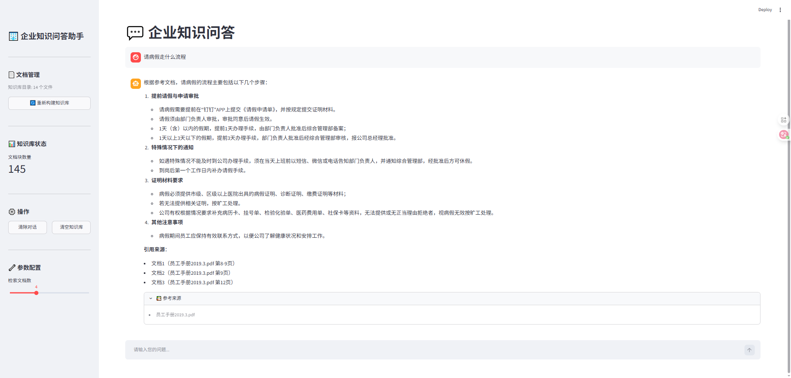

# 🏢 企业知识问答助手 — Enterprise Knowledge Q&A Assistant

基于 **LangChain + RAG + ChromaDB** 构建的企业级知识问答系统，支持多格式文档导入、语义检索和智能问答。
系统截图：
## 功能概览

- **多格式文档加载**：支持 PDF、Word、Markdown、TXT 文档的批量导入
- **智能文档分割**：递归字符分割 + Markdown 结构分割，保持语义完整性
- **向量语义检索**：基于 ChromaDB 的向量存储与相似性搜索
- **RAG 增强生成**：使用 LCEL 构建的检索增强生成链，回答可追溯来源
- **混合检索策略**：语义检索（向量）+ 关键词检索（BM25）混合，可配置权重
- **对话记忆管理**：短期会话记忆 + 长期向量存储记忆
- **双模式交互**：CLI 命令行 + Streamlit Web 界面

## 架构

```
┌─────────────────────┐     ┌──────────────────────────┐
│   Python 3.11+       │     │   Docker (容器)            │
│                     │     │                          │
│   LangChain LCEL     │────▶│   ChromaDB :8001          │
│   RAG Pipeline      │     │   (向量数据库)              │
│                     │     │                          │
│   Streamlit Web UI  │────▶│   Elasticsearch :9200     │
│   CLI Interface     │     │   (BM25 全文检索)          │
│                     │     └──────────────────────────┘
│                     │
│   ▶ API 调用 ────────▶   DeepSeek API (Chat)
│   ▶ API 调用 ────────▶   豆包 API (Embedding)
└─────────────────────┘
```

## 项目结构

```
enterprise_qa_assistant/
├── .env                        # 环境变量（API Keys 等）
├── .vscode/settings.json       # VSCode 配置
├── docker-compose.yml          # Docker 中间件
├── requirements.txt            # 项目依赖
├── config.py                   # 统一配置管理
├── embeddings.py               # 豆包多模态 Embedding 封装
├── main.py                     # CLI 命令行入口
│
├── document_loader/
│   └── loader.py               # 多格式文档加载器
├── document_processor/
│   └── splitter.py             # 文档分割策略
├── vector_store/
│   └── store.py                # ChromaDB 向量数据库管理
├── rag/
│   ├── chain.py                # RAG 核心链（LCEL）
│   └── retriever.py            # 混合检索器 + 查询重写
├── memory/
│   └── history.py              # 对话历史管理
├── web_app/
│   └── app.py                  # Streamlit Web 界面
├── utils/
│   └── helpers.py              # 工具函数
└── data/
    ├── documents/              # 测试用企业文档
    ├── chroma_data/            # ChromaDB 持久化数据
    └── es_data/                # Elasticsearch 数据
```

## 技术栈

| 层次 | 技术 |
|------|------|
| 框架 | LangChain 1.3 + LCEL (LangChain Expression Language) |
| 模型 | DeepSeek-V4-Pro (Chat) + 豆包 Embedding-Vision (向量化) |
| 向量数据库 | ChromaDB (Docker 服务端) |
| 全文检索 | Elasticsearch 8.15 |
| 前端 | Streamlit 1.59 |
| 运行环境 | Python 3.11, Docker Compose |

## 快速开始

### 1. 环境准备

**安装 Docker Desktop**（[下载地址](https://docs.docker.com/desktop/)），启动后确保 Docker Engine 运行。

**创建 Python 虚拟环境**（推荐 Conda）：

```bash
conda create -n py-langchain-homework-2 python=3.11 -y
conda activate py-langchain-homework-2
pip install -r requirements.txt
```

**启动 Docker 中间件**：

```bash
docker compose up -d
```

验证服务：

```bash
curl http://localhost:8001/api/v1/heartbeat   # ChromaDB
curl http://localhost:9200                    # Elasticsearch
```

### 2. 配置环境变量

编辑 `.env` 文件，填入 API Keys：

```env
# DeepSeek Chat 模型
DEEPSEEK_API_KEY=your_deepseek_api_key
DEEPSEEK_BASE_URL=https://api.deepseek.com
DEEPSEEK_MODEL=deepseek-v4-pro

# 豆包 Embedding 模型
DOUBAO_API_KEY=your_doubao_api_key
DOUBAO_EMBEDDING_BASE_URL=https://ark.cn-beijing.volces.com/api/v3
DOUBAO_EMBEDDING_MODEL=doubao-embedding-vision-251215

# ChromaDB (Docker)
CHROMA_HOST=localhost
CHROMA_PORT=8001

# Elasticsearch (Docker)
ES_HOST=http://localhost:9200
```

> **注意**： `.env` 中的 API Key 是敏感信息，已在 `.gitignore` 中排除，请勿提交到仓库。

### 3. 运行

**CLI 模式**：

```bash
python main.py
```

CLI 命令：

| 命令 | 说明 |
|------|------|
| `load data/documents/` | 加载目录下所有文档到知识库 |
| `ask <问题>` | 基于知识库提问 |
| `status` | 查看知识库状态 |
| `history` | 查看对话历史 |
| `clear` | 清除对话历史 |
| `export` | 导出对话记录为 JSON |
| `quit` | 退出 |

**Web 模式**：

```bash
streamlit run web_app/app.py
```

浏览器打开 `http://localhost:8501`，左侧上传文档构建知识库，右侧进行对话问答。

## 使用示例

```
> load data/documents/
16:37:58 [INFO] 目录加载完成: 共 64 个文档片段
16:37:58 [INFO] 文档分割: 64 → 137 个块
16:38:33 [INFO] 向量数据库构建完成: 137 个文档块

> ask 公司的年假政策是什么？

📝 回答:
根据公司休假政策，年假制度如下：

- 工作满一年：享受 5 天带薪年假
- 工作满三年：享受 10 天年假
- 工作满五年：享受 15 天年假
- 年假需提前一周申请，可分次使用，最小单位为半天

📚 参考来源:
  [1] 公司休假政策.md
  [2] 员工手册2019.3.pdf
```

## 自定义

### 更换 LLM 模型

修改 `.env` 中的模型配置即可，任何兼容 OpenAI API 格式的模型都可以接入。

### 调整文档分割参数

在 `config.py` 中修改：

```python
CHUNK_SIZE = 500       # 文档块大小
CHUNK_OVERLAP = 50     # 块间重叠
RETRIEVAL_K = 4        # 检索返回数量
```

### 不使用 Docker

系统会自动回退到本地嵌入式 ChromaDB，无需任何配置修改。

## 许可证

MIT License
